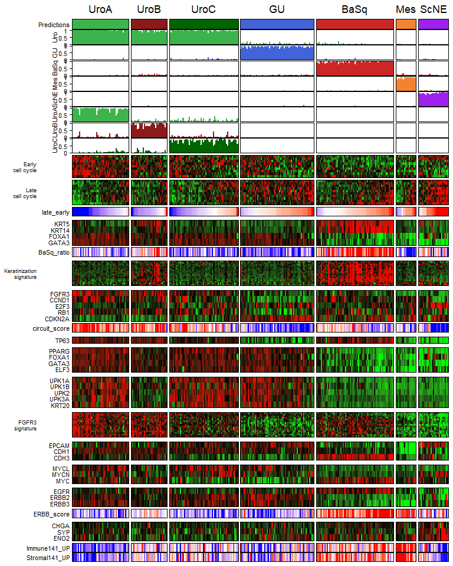

<!-- README.md is generated from README.Rmd. Please edit that file -->

# LundTax2023Classifier

<!-- badges: start -->
<!-- badges: end -->

This package implements a Random Forest rule-based single-sample
predictor that classifies gene expression samples into the 5 (or 7,
including subclasses) Lund Taxonomy molecular subtypes. The final
classifier is composed of two separate predictors applied sequentially -
first a sample is classified as one of the 5 main classes (Uro, GU,
BaSq, Mes or ScNE), and then samples classified as Uro are subclassified
into UroA, UroB or UroC by a second predictor. The package includes a
sample dataset (Lund2017) to run the classifier.

## Installation

You can install LundTax2023Classifier from [GitHub](https://github.com/)
with:

``` r
# install.packages("devtools")
devtools::install_github("LundBladderCancerGroup/LundTaxonomy2023Classifier")
```

## Usage

### Prediction

``` r
predict_LundTax2023(data, include_data = FALSE, include_scores = TRUE, ...)
```

Where `data` is a matrix, data frame or multiclassPairs_object of gene
expression values with genes as HUGO gene symbols in rows and samples in
columns.

`include_data` is a logical value indicating if the gene expression
values should be included in the results object.

`include_scores` is a logical value indicating if the prediction scores
should be included in the results object.

The predict function includes an imputation feature to handle missing
genes in the data. This can be accessed by adding the “impute = TRUE”
argument.

#### Example

``` r
library(LundTax2023Classifier)
results <- predict_LundTax2023(Lund2017)
str(results)
#> List of 3
#>  $ scores              : num [1:301, 1:8] 0.9924 0.0016 0.0682 0.993 0.9808 ...
#>   ..- attr(*, "dimnames")=List of 2
#>   .. ..$ : chr [1:301] "p1404_1.CEL" "2.CEL" "3.CEL" "4.CEL" ...
#>   .. ..$ : chr [1:8] "Uro" "UroA" "UroB" "UroC" ...
#>  $ predictions_7classes: Named chr [1:301] "UroA" "Mes" "GU" "UroA" ...
#>   ..- attr(*, "names")= chr [1:301] "p1404_1.CEL" "2.CEL" "3.CEL" "4.CEL" ...
#>  $ predictions_5classes: Named chr [1:301] "Uro" "Mes" "GU" "Uro" ...
#>   ..- attr(*, "names")= chr [1:301] "p1404_1.CEL" "2.CEL" "3.CEL" "4.CEL" ...

# Include data in result
results_data <- predict_LundTax2023(Lund2017,
                               include_data = TRUE)
str(results_data)
#> List of 4
#>  $ data                : num [1:15697, 1:301] 4.25 8.35 6.69 7.26 3.74 ...
#>   ..- attr(*, "dimnames")=List of 2
#>   .. ..$ : chr [1:15697] "A1CF" "A2M" "A2ML1" "A4GALT" ...
#>   .. ..$ : chr [1:301] "p1404_1.CEL" "2.CEL" "3.CEL" "4.CEL" ...
#>  $ scores              : num [1:301, 1:8] 0.9924 0.0016 0.0682 0.993 0.9808 ...
#>   ..- attr(*, "dimnames")=List of 2
#>   .. ..$ : chr [1:301] "p1404_1.CEL" "2.CEL" "3.CEL" "4.CEL" ...
#>   .. ..$ : chr [1:8] "Uro" "UroA" "UroB" "UroC" ...
#>  $ predictions_7classes: Named chr [1:301] "UroA" "Mes" "GU" "UroA" ...
#>   ..- attr(*, "names")= chr [1:301] "p1404_1.CEL" "2.CEL" "3.CEL" "4.CEL" ...
#>  $ predictions_5classes: Named chr [1:301] "Uro" "Mes" "GU" "Uro" ...
#>   ..- attr(*, "names")= chr [1:301] "p1404_1.CEL" "2.CEL" "3.CEL" "4.CEL" ...
```

``` r
# Imputation
# Remove 100 genes from data
missing_genes <- sample(1:nrow(Lund2017),100)
Lund2017_missinggenes <- Lund2017[-missing_genes,]
results_imputation <- predict_LundTax2023(Lund2017_missinggenes,
                                          impute = TRUE)
#> These genes are not found in the data:
#> ZNF561 LRRC8A FANCC PRLR PPIE
#> Gene names should as rownames and sample names as columns!
#> Check the genes in classifier object to see all the needed genes.
#> Check if '-' or ',' symbols in the gene names in your data. You may need to change it to '_' or '.'
#> Missed genes will be imputed to the closest class for each sample!
#> These genes have NAs:
#> ZNF561 LRRC8A FANCC PRLR PPIE
#> These genes will be imputed to the closest class for each sample with NAs
```

The classifier returns a list of up to 4 elements: 
- `data` original gene expression values. 
- `scores` matrix containing predictions scores for 8 classes (Uro, UroA, UroB, UroC, GU, BaSq, Mes and ScNE). 
- `predictions_7classes` named vector, with sample names as names and subtype labels as values. 
- `predictions_5classes` named vector, with sample names as names and subtype labels as values.

Both data and scores can be excluded or included from the final output 
by modifying the `include_data` and `include_scores` parameters, respectively.

### Plotting

A plotting function is included to draw a heatmap showing genes, gene
signatures and scores of interest. This function requires the
[ComplexHeatmap](https://github.com/jokergoo/ComplexHeatmap) package.

``` r
plot_signatures(
  results_object,
  data = NULL,
  title = "",
  annotation = c("5 classes", "7 classes")[2],
  plot_scores = TRUE,
  show_ann_legend = FALSE,
  show_hm_legend = FALSE,
  set_order = NULL,
  ann_height = 6,
  font.size = 8,
  norm = c("scale", NULL)[1]
)
```

Parameters:

- `results_object` is a list resulting from applying the
  predict_LundTax2023 function

- `data` is a matrix, data frame or multiclassPairs_object of gene
  expression values with genes as HUGO gene symbols in rows and samples
  in columns. This can be included if the results_object does not
  include the data, and samples should be in the same order as in the
  results object.

- `title` title for the heatmap.

- `annotation` is a character indicating if 5 (“5 classes”) or 7 class
  (“7 classes”) annotations should be plotted.

- `plot_scores` is a logical value indicating if the prediction scores
  should be plotted.

- `show_ann_legend` is a logical value indicating if the annotation
legend should be shown.

- `show_hm_legend` is a logical value indicating if the heatmap legend
  should be shown.

- `set_order` is a logical value indicating if the prediction scores
  should be plotted.

- `font.size` font size, default is 8.

- `norm` indicates if data should be scaled/Z-normalized. If “NULL”,
  data is plotted as is.

- `ann_heigh` annotation height in cm, default is 6.

#### Example

``` r
# Including data in results object
results <- predict_LundTax2023(Lund2017,
                              include_data = TRUE)
plot_signatures(results)
```



