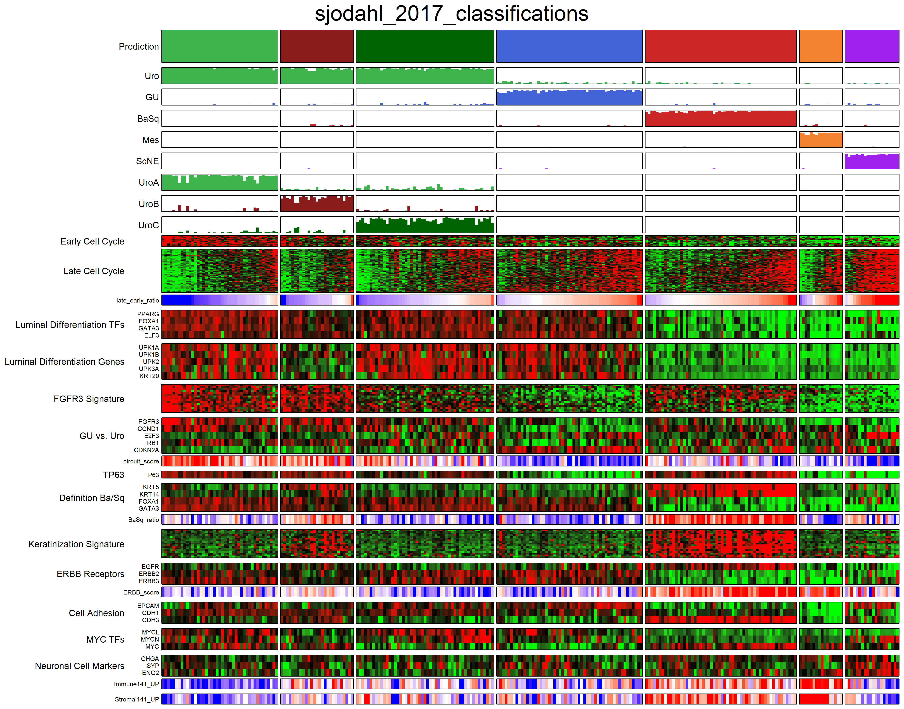
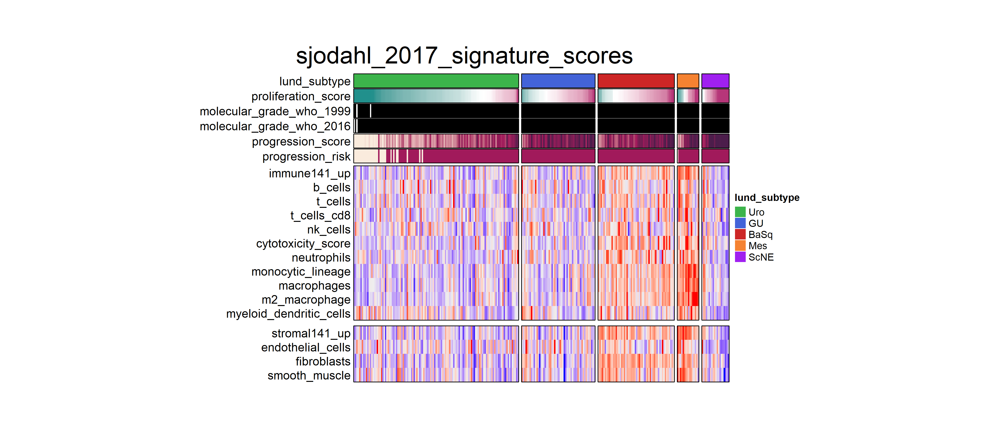

```{r setup, include = FALSE}
knitr::opts_chunk$set(warning = FALSE, 
                      fig.width = 7, 
                      fig.height = 5, 
                      fig.align = "center")
```

```{r load_packages, message = FALSE, warning = FALSE}
#load Lund Taxonomy Classifier
library(LundTax2023Classifier)
library(knitr)
library(grid)
```

# Lund Taxonomy Classifier
This package depends on a set of internal and exported functions.
The main functions intended for the user are; `lundtax_predict_sub`, `lundtax_calc_sigscore`, `plot_hm_signatures`, `plot_hm_sigscores`, `plot_ranked_score`, `plot_subscore_violin`, `plot_subscore_box`, `plot_ranked_score`. In this tutorial, we will demonstrate 
how to use these functions, using the bundled data to get the most out from this package.

## Bundled Data
Before we get started, let's start with exploring some of the relevant bundled data objects.

### Expression Data
This package includes an example expression data set. This data is a subset of samples from the Sjodahl 2017 paper. What are the dimensions of this data object?

```{r, expression data dimensions}
dim(sjodahl_2017)
```

The expression data set has 15607 rows (genes) and 267 columns (samples). Let's have a look at the a the first 5 rows and 5 columns to get an idea of what the data looks like.

```{r expression data overview}
knitr::kable(sjodahl_2017[1:5, 1:5], 
             caption = "Table 1. Bundled expression data subset")
```

### Metadata
The package also includes meta data for samples included in the expression data set. The metadata can be used to aggregate the prediction calls, allowing for interesting association between various metadata variables and specific subtypes. Let's explore this data set by over viewing what clinical information is available.

```{r metadata}
str(sjodahl_2017_meta)
```

If the user wants to use their own metadata, this should be in a data frame format with unique sample identifiers in a column called `sample_id`. For a more detailed explanation of the variables, see the data set documentation.

### Other Bundled Objects
this package also includes a variety of data objects needed for the predictor. For example, classifiers for predicting grade and subtype, lists with genes identifiers for making prediction calls and gene signatures. Let's explore a few of these.

The `gene_list` holds information on gene identifiers that the predictor is based on. This object has
gene identifiers in both HGNC and Ensembl format, allowing the incoming data to be in either of these formats. 

```{r gene list}
knitr::kable(head(gene_list, 5),
             caption = "Table 2. Gene List")
```

How many genes in total, are included in the `gene_list` object?

```{r n genes}
nrow(gene_list)
```

The `signatures` object has all the information on gene/signature association. This object is a list of 6 data frames, for different signatures. Typically, the columns of each data frame are the following; `hgnc_symbol`, `ensembl_gene_id` and `signature`. Let's have a look at the immune signatures object in this list.

```{r immune signatures}
knitr::kable(table(signatures$immune$signature), 
             caption = "Table 3. Immune Signatures", 
             col.names = c("Signature", "Genes (n)"))
```

## Get Data
To get started, if the user wants to separate and subset the incoming data based on various metadata criteria, `get_data` is available. This function can return data in a few different formats. 

First, in metadata format (default). This requires the user to provide the function with an incoming metadata object. This should be a data frame with unique samples in rows. The column title with sample information should be called 'sample_id'. If not, the function can in a couple of ways accommodate for this. For example, the user can run the function with `rows_to_column = TRUE` to create a new column named sample_id from row names. Alternatively, the function can also look for sample IDs in a different column (if it's named anything other than sample_id). To do this, set `sample_column` to the name of the corresponding sample column in the incoming metadata. If metadata is provided for the function, the user can easily subset the data based on three filtering options. See `first,variable`, `second_variable`, and `third_variable` and the corresponding `first_value`, `second_value`, and `third_value` parameter descriptions for more information. 

As a second option, the user can set the `return_type` to `sample_id`, this will return a vector of characters with sample IDs. 

Lastly, the function can also subset an incoming expression matrix. To do so, set `return_type = "expression_data"` and provide the expression data with `this_data`.

### Example 1 - Metadata Subset
In this first example we will provide the function with metadata and restrict it to a set number of samples. To do so, we will call the function with `this_metadata` and `these_sample_ids`. The return type will remain in tidy metadata format.

```{r metadata_sub1}
#define some samples
my_samples = c("1.CEL", "2.CEL", "3.CEL", "4.CEL", "5.CEL")

#subset metadata to samples of interest
sjodahl_sub1 = get_data(this_metadata = sjodahl_2017_meta, 
                       these_sample_ids = my_samples, 
                       return_type = "metadata")

#print sample IDs in the return
sjodahl_sub1$sample_id
```

### Example 2 - Metadata Subset
We can also provide more extensive filtering options. In this example we are selecting females, `turb_stage = 1` and `adj_chemo = 0`. We are also excluding a few samples, demonstrating the usage of `exclude_id` parameter. Lastly, we will also subset the bundled expression matrix to the retained sample IDs.

```{r metadata_sub2}
#run funciton
sjodahl_sub2 = get_data(this_metadata = sjodahl_2017_meta,
                        return_type = "expression_data", 
                        this_data = sjodahl_2017,
                        exclude_id = c("5.CEL", "9.CEL", "15.CEL"),
                        first_variable = "gender", 
                        first_value = "Female", 
                        second_variable = "turb_stage", 
                        second_value = 1, 
                        third_variable = "adj_chemo", 
                        third_value = 0)

#print the dimensions
dim(sjodahl_sub2)
```

## Subtype Prediction
The main function in this package is `lundtax_predict_sub`. This function makes prediction calls based on gene expression data. It also internally calls `lundtax_calc_sigscore` to calculate signature scores for a variety of, for the subtype, relevant signature scores. The main input for this function is a data object with expression values, given to the `this_data` parameter. This should be a data frame or matrix with expression values, gene identifiers in as row names and samples in columns. The function supports gene identifiers in one of the following formats; **HGNC symbols** (default) or **Ensembl Gene IDs**. The format for the provided gene identifiers should be given to the `gene_id` parameter. This function also depends on the `predict_RF` function from `multiclassPairs`. Thus, the function can also take arguments from this function. For example, if required genes are missing from the input data, the user can run the prediction function with `impute = TRUE`.

### Example 1 - Predict Subtype
In this first example we will call this function on the bundled expression data to determine a subtype for each of the included samples. Note, that we run this example with `impute = TRUE` to compensate for missing genes in the demo data set. For transparency, all other parameters are called with default values, but still printed out for demonstrating purposes.

```{r sjodahl predicted, results = 'hide', message = FALSE}
sjodahl_predicted = lundtax_predict_sub(this_data = sjodahl_2017, 
                                        gene_id = "hgnc_symbol",
                                        impute = TRUE,
                                        threshold_progression = 0.58,
                                        log_transform = TRUE, 
                                        adjust = FALSE, 
                                        adj_factor = 5.1431, 
                                        impute_reject = 0.67, 
                                        impute_kNN = 5, 
                                        subtype_only = FALSE, 
                                        include_data = FALSE, 
                                        include_pred_scores = TRUE, 
                                        verbose = FALSE)
```

Let's explore what the returned object looks like. The return is a list of 4, with the following information in it.

```{r predicted lsit}
knitr::kable(summary(sjodahl_predicted), 
             caption = "Table 4. Prediction Calls", 
             col.names = c("Object", "Length", "Class", "Mode"))
```

The `subtype_scores` object holds all the subtype prediction scores for all included samples.

```{r subtype score}
knitr::kable(head(sjodahl_predicted$subtype_scores, 5), 
             caption = "Table 5. Prediction Scores",)
```

The second and third element in the list has the 7 class  and 5 class prediction calls respectively. 

```{r prediction classes}

knitr::kable(cbind(head(sjodahl_predicted$predictions_7classes, 5),
                   head(sjodahl_predicted$predictions_5classes, 5)), 
             caption = "Table 6. Prediction Classes Combined",
             col.names = c("Sample ID", "7 Class", "5 Class"))
```

The last object in the returned list has all the signature scores, let's start with printing the available variables in this object

```{r signature scores variables}
colnames(sjodahl_predicted$scores)
```

Let's also print out the first 5 rows and 3 columns of this object.

```{r signature sample}
knitr::kable(sjodahl_predicted$scores[1:5, 1:3], 
             caption = "Table 7. Signature Score Subset")
```

## Visualization
This part of the vignette will demonstrate how to integrate the plotting functions to the return of the main functions in this package. Currently, there are five alternatives for visualize the results;

`plot_hm_signatures`, `plot_hm_score`, `plot_ranked_score`, `plot_subscore_box`, and `plot_subscore_violin`. 

### Plot Heatmap Signatures
Constructs a heatmap, including genes and signatures of interest, with prediction results and scores on top. Here, we are using the prediction data set generated in the previous example as input for the plotting function. 

Tip, it's possible to run the plotting function on just one object (i.e no need to provide `this_data` separately), to do so, run the prediction function with `include_data = TRUE`.

```{r heatmap signatures, results = 'hide'}
plot_hm_signatures(these_predictions = sjodahl_predicted, 
                   this_data = sjodahl_2017,
                   subtype_annotation = "7_class",
                   out_format = "png", 
                   out_path = "../man/figures/", 
                   gene_id = "hgnc_symbol", 
                   plot_title = "sjodahl_2017_classifications")
```

```{r figure 1, echo = FALSE, out.width = '100%', dpi = 300, fig.cap = "Figure 1, Heatmap Classification Signatures"}

```

### Plot Heatmap Signatures
This functions builds a heatmap for the signature scores (4th element in the returned list with the classifier function). This allows for a rapid and comprehensive overview of how the different signature scores can relate to the different subtypes. In this example, again, we are using the prediction calls from the classifier in the example. The function is called with default parameters.

```{r heatmap scores, results = 'hide'}
plot_hm_scores(these_predictions = sjodahl_predicted,
               verbose = FALSE, 
               out_format = "png",
               out_path = "../man/figures/",
               plot_title = "sjodahl_2017_signature_scores")
```

```{r figure 2, echo = FALSE, out.width = '100%', dpi = 300, fig.cap = "Figure 2, Heatmap Signature Scores"}

```

This function can also be run with `return_scores = TRUE` to return the plotting data in a tidy format for the user to either run their own plotting scripts or, aggregating with clinical data, etc. Let's return this version of the data with the function and see what it looks like.

```{r return plot data}
sjodahl_scores = plot_hm_scores(these_predictions = sjodahl_predicted, 
                                title = "sjodahl_2017",
                                verbose = FALSE, 
                                return_scores = TRUE)
```

Let's print the column names and type of the returned scores data frame.

```{r scored data frame}
str(sjodahl_scores)
```

The function can also return the data from in `xlsx` format. To do so, run the function with `return_xlsx = TRUE`. 

### Plot Ranked Score
This function returns a point-plot with ranked scores for a set variable. It takes a predictions data set together with a score variable, subtype class and returns a point plot (grob) with ranked scores along the x axis and scores along the y axis. The returned plot will also color fill the points based on subtype classification palette. In this example, we are plotting proliferation score for all subtypes in the 7 class group.

```{r plot ranked score, message = FALSE}
plot_ranked_score(these_predictions = sjodahl_predicted, 
                  out_path = "../man/figures/", 
                  title = "sjodahl_2017", 
                  out_format = "png", 
                  plot_width = 3.8, 
                  plot_height = 2, 
                  this_score = "proliferation_score", 
                  subtype_class = "7_class", 
                  plot_title = "sjodahl_2017_proliferation_score")
```

```{r figure 3, echo = FALSE, out.width = '80%', dpi = 300, fig.cap = "Figure 3, Ranked Score"}

```

### Plot Subtype Score (Box)
This functions takes the output from `lundtax_predict_sub` and return a stacked barplot plot where each bar is representing the distribution of the, for that class, subtype prediction score. Set the desired subtype with `this_subtype`. The subtype can be one of the subtypes included in the LundTax subtype classification nomenclature.

```{r plot subscore box}
plot_subscore_box(these_predictions = sjodahl_predicted, 
                  this_subtype = "Uro", 
                  out_path = "../man/figures/", 
                  plot_title = "sjodahl_2017", 
                  out_format = "png", 
                  plot_width = 3.8, 
                  plot_height = 2)
```

```{r figure 4, echo = FALSE, out.width = '80%', dpi = 300, fig.cap = "Figure 4, Subtype Score Boxplot"}

```

### Plot Subtype Score (Violin)
Similarly, `plot_subscore_violin` take the output from `lundtax_predict_sub` and return a violin plot where each violin represent the distribution of the, for that class, subtype prediction score. Set the subtype of desire with `this_subtype`. The subtype can be one of the subtypes included in the LundTax subtype classification nomenclature. Parameters starting with the plot prefix are available for the user to gain more control of the returned plot. The user can also return the wrangled data used in the plot by setting `return_data = TRUE`.

```{r plot subscore violin}
plot_subscore_violin(these_predictions = sjodahl_predicted, 
                     this_subtype = "GU", 
                     plot_adjust = 2, 
                     plot_scale = "width", 
                     plot_trim = FALSE,
                     out_path = "../man/figures/", 
                     plot_title = "sjodahl_2017", 
                     out_format = "png", 
                     plot_width = 3.8, 
                     plot_height = 2)
```

```{r figure 5, echo = FALSE, out.width = '80%', dpi = 300, fig.cap = "Figure 5, Subtype Score Violin Plot"}

```
